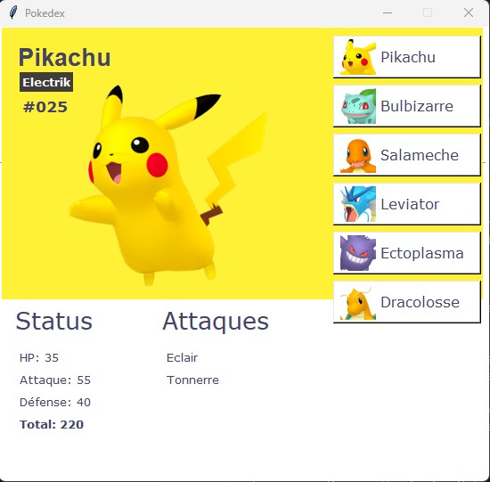
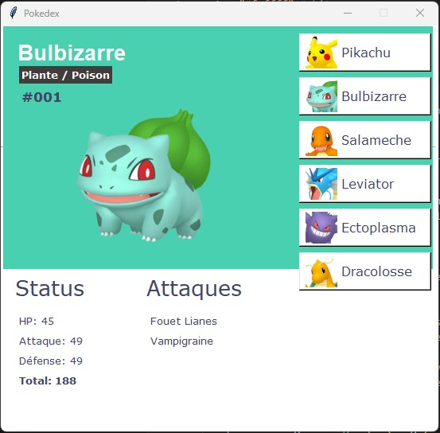
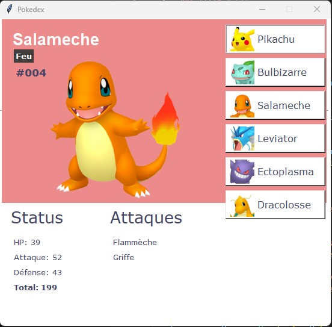
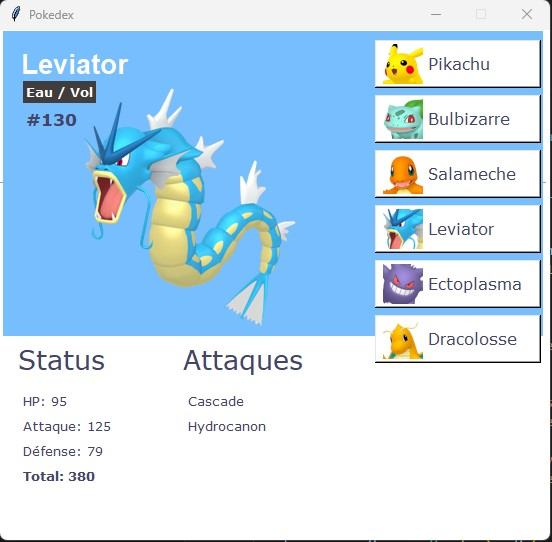
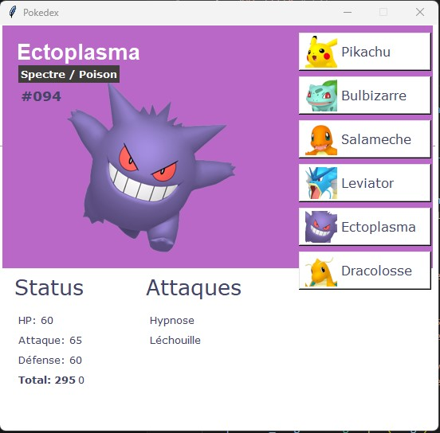
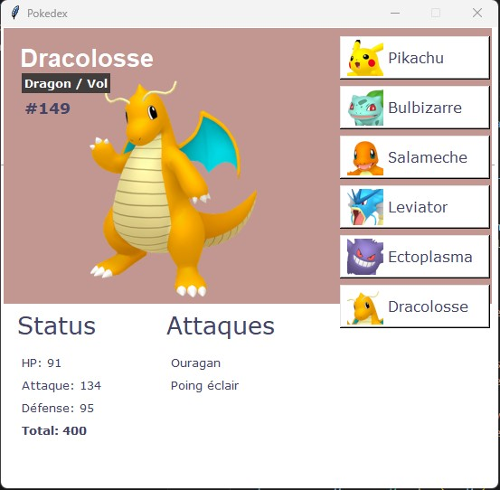

[![Contributors][contributors-shield]][contributors-url]
[![Forks][forks-shield]][forks-url]
[![Stargazers][stars-shield]][stars-url]
[![Issues][issues-shield]][issues-url]
[![LinkedIn][linkedin-shield]][linkedin-url]

  

     
    <a href="https://github.com/LaureZammit/Pokedex-Tkinter">Voir les documents</a>
    &nbsp;
    ·
    &nbsp;
    <a href="https://github.com/LaureZammit/Pokedex-Tkinter/issues">Rapporter une erreur</a>

# LES OBJECTIFS - POKEDEX PYTHON

Pokedex créé en suivant un tutoriel YOUTUBE créé par [Girl Coder](https://www.youtube.com/watch?v=8gxJUUPMt2w)

## Informations

### Utilisation de :
 

* Tkinter
* Variables
* Fonction
* Condition if... else

#### Widget
* Label
* Images
* Boutons

## Aperçu du projet terminé

  
  &nbsp;
  
  &nbsp;
  
  

  
  &nbsp;
  
  &nbsp;
  

## Auteure

* Laure Zammit

## Contact

Laure Zammit - laurezammit@gmail.com

Project Link: [https://github.com/LaureZammit/Pokedex-Tkinter.git](https://github.com/LaureZammit/Pokedex-Tkinter.git)

## Remerciements

* [Jean-Louis ERRANTE](https://www.errantecreation.com/) : formateur
* [Girl Coder](https://www.youtube.com/watch?v=8gxJUUPMt2w) : tutoriel Youtube

* [PurpleBooth](https://github.com/PurpleBooth/a-good-readme-template) : modèle de Readme très complet
* [Othneildrew](https://github.com/othneildrew/Best-README-Template/blob/master/README.md) - Readme Template

<!-- MARKDOWN LINKS & IMAGES -->
<!-- https://www.markdownguide.org/basic-syntax/#reference-style-links -->
[contributors-shield]: https://img.shields.io/github/contributors/LaureZammit/Pokedex-Tkinter.svg?style=for-the-badge
[contributors-url]: https://github.com/LaureZammit/Pokedex-Tkinter/graphs/contributors
[forks-shield]: https://img.shields.io/github/forks/LaureZammit/Pokedex-Tkinter.svg?style=for-the-badge
[forks-url]: https://github.com/LaureZammit/Pokedex-Tkinter/forks
[stars-shield]: https://img.shields.io/github/stars/LaureZammit/Pokedex-Tkinter.svg?style=for-the-badge
[stars-url]: https://github.com/LaureZammit/Pokedex-Tkinter/stargazers
[issues-shield]: https://img.shields.io/github/issues/LaureZammit/Pokedex-Tkinter.svg?style=for-the-badge
[issues-url]: https://github.com/LaureZammit/Pokedex-Tkinter/issues

[linkedin-shield]: https://img.shields.io/badge/-LinkedIn-black.svg?style=for-the-badge&logo=linkedin&colorB=555
[linkedin-url]: https://www.linkedin.com/in/laure-zammit-84a3b3150/

[Html]: https://img.shields.io/badge/HTML-E34F26
[Html-url]: https://developer.mozilla.org/fr/docs/Web/HTML
[Css]: https://img.shields.io/badge/CSS-1572B6
[Css-url]: https://developer.mozilla.org/fr/docs/Learn/Getting_started_with_the_web/CSS_basics
[Vscode]: https://img.shields.io/badge/VSCode-007ACC
[Vscode-url]: https://code.visualstudio.com/
